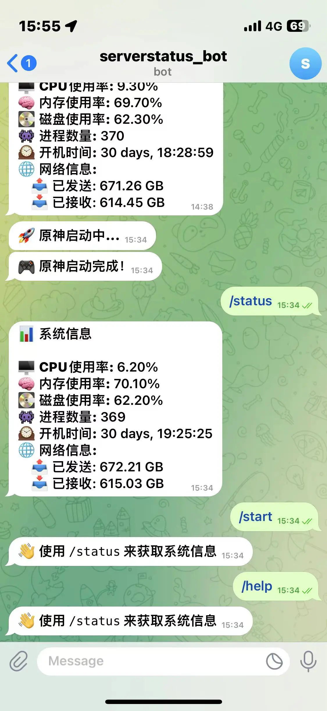
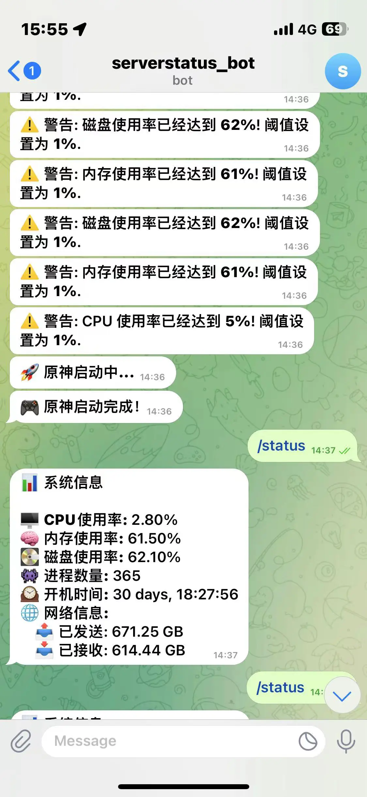

# TeleMonitor

TeleMonitor 是一个使用 Python 编写的系统监控工具，它可以监控 CPU、内存和磁盘的使用情况，并通过 Telegram 发送警告。

## 使用

首先，你需要创建一个 Telegram bot，然后获取 API token。你可以参考 [Telegram 官方文档](https://core.telegram.org/bots/features#botfather) 来创建一个 Telegram bot。

然后，你需要获取你希望接收警告的 Telegram chat ID。你可以使用 [@userinfobot](https://t.me/userinfobot) 来获取你的 chat ID。

接下来 clone 这个项目：

```bash
git clone https://github.com/bboysoulcn/telemonitor.git
```

你可以使用docker compose 来运行 Telemonitor：

```bash
docker-compose up -d
```

或者你可以使用 k8s 来运行 Telemonitor：

```bash
kubectl apply -f deployment.yaml
```

下面是 Telemonitor 的环境变量：

- `TG_API_TOKEN`: 你的 Telegram bot 的 API token。
- `TG_CHAT_ID`: 你希望接收警告的 Telegram chat ID。
- `TG_API_BASE_URL`: Telegram API 的基础 URL，默认值为 `https://api.telegram.org`.
- `CPU_PERCENT`: CPU 使用率的阈值，超过这个阈值时，Telemonitor 会发送警告，默认值为 80。
- `MEMORY_PERCENT`: 内存使用率的阈值，超过这个阈值时，Telemonitor 会发送警告，默认值为 80。
- `DISK_PERCENT`: 磁盘使用率的阈值，超过这个阈值时，Telemonitor 会发送警告，默认值为 80。
- `MONITOR_INTERVAL`: 监控的间隔时间（秒），默认值为 60。
- `DISK_PATH`: 磁盘的路径，默认值为 `/host`。
- `URL_LIST`: 需要监控的 URL 列表，用逗号分隔，默认值为空。

下面是机器人的命令：

- /start - 获取帮助
- /help - 获取帮助
- /status - 获取系统状态

### 如果你不能访问Telegram API

你可以使用下面项目创建一个 api 代理，并且修改环境变量 TG_API_BASE_URL

[teleproxy](https://github.com/bboysoulcn/teleproxy)

### 效果展示




## 贡献者

- [SimonGino](https://github.com/SimonGino)

## 广告位

我的tg频道 [https://t.me/bboyapp](https://t.me/bboyapp)

## 许可证

这个项目使用 MIT 许可证，详情请见 [LICENSE](LICENSE) 文件。
